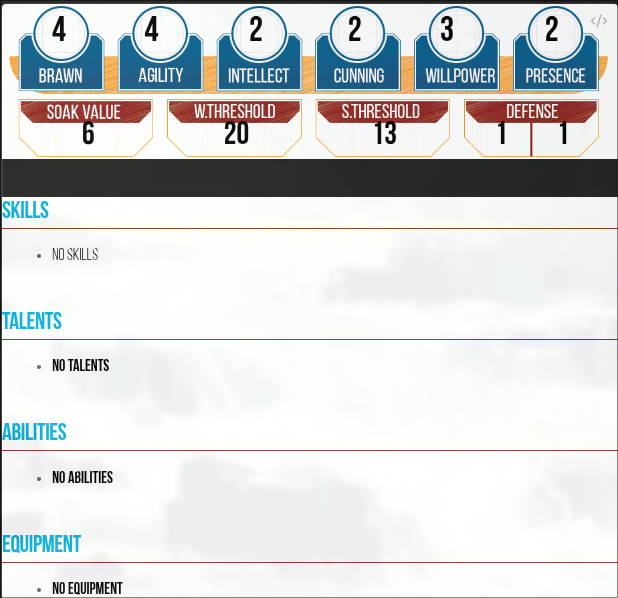
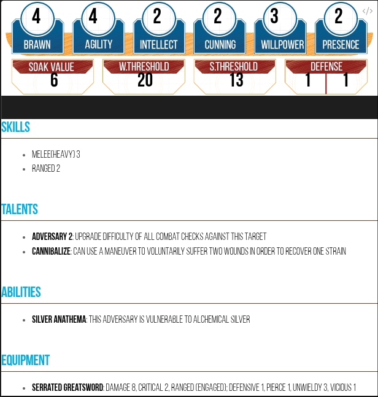

# Genesys Stat Blocks
This plugin is a stat block generator inspired by Javalent's [Fantasy Stat Block](https://github.com/javalent/fantasy-statblocks). It uses a `genesys` codeblock to render NPC stats for the Genesys TTRPG.

## Example minimum code block
The minimum requirements for the stat block are **name, type, attributes, and derived attributes**
```genesys
name: Death Knight
type: nemesis
attributes:
  brawn: 4
  agility: 4
  intellect: 2
  cunning: 2
  willpower: 3
  presence: 2
derived_attributes:
  soak_value: 6
  wound_threshold: 20
  strain_threshold: 13
  melee_defense: 1
  ranged_defence: 1
```


### Additional Fields
Skills, Talents, Abilities, and Equipment can also be added
```genesys
name: Death Knight
type: nemesis
attributes:
  brawn: 4
  agility: 4
  intellect: 2
  cunning: 2
  willpower: 3
  presence: 2
derived_attributes:
  soak_value: 6
  wound_threshold: 20
  strain_threshold: 13
  melee_defense: 1
  ranged_defence: 1

skills: 
  - name: Melee(Heavy) 3
  - name: Ranged 2
talents:
  - name: Adversary 2
    description: Upgrade Difficulty of all combat checks against this target
  - name: Cannibalize
    description: Can use a maneuver to voluntarily suffer two wounds in order to recover one strain
abilities:
  - name: Silver Anathema
    description: This adversary is vulnerable to alchemical silver
equipment:
  - name: Serrated greatsword
    description: Damage 8, Critical 2, Ranged (Engaged); Defensive 1, Pierce 1, Unwieldy 3, Vicious 1
```


## Additional Goals
- Get Name and type Rendering with format **Name**(type)
- Change render to only show attributes with minimal statblock
- Fix Gap between stats and extra info